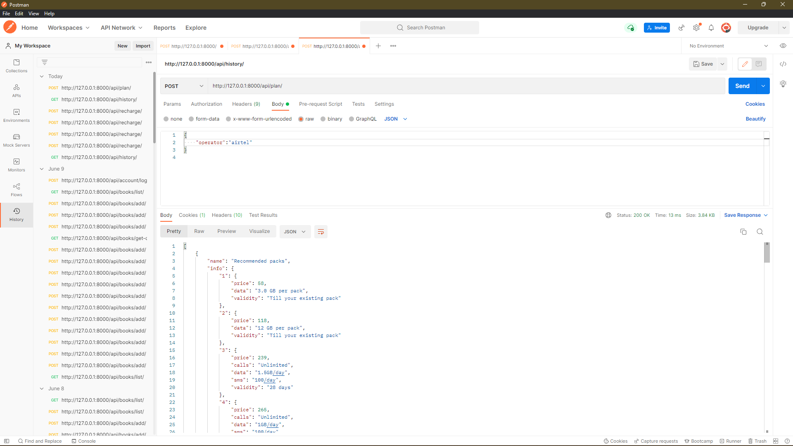
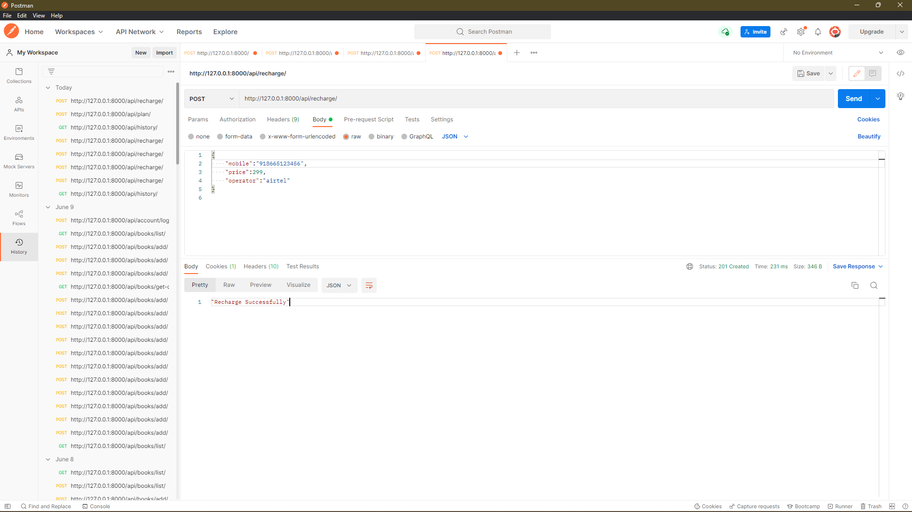
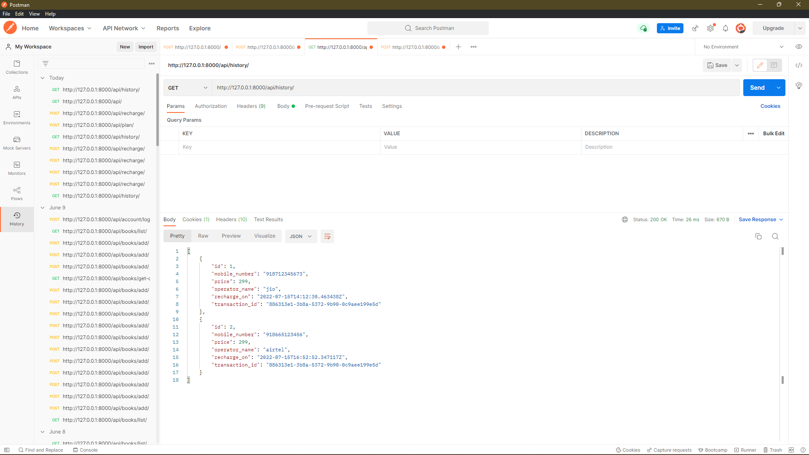

# <u>Assingment Innovatia</u>
#### In this assingment there are three api i.e. :-
1. http://127.0.0.1:8000/api/plan/ for view plan.
2. http://127.0.0.1:8000/api/recharge/ for fake recharge.
3. http://127.0.0.1:8000/api/history/  for check recharge history.

#### Now some screenshots from vscode are:-
* _helpers.py_

* models.py
  
* serilizers.py
  
* views.py
  
* urls.py
  

#### Now some screenshots from postman are:-
* plan api
  
* recharge api
  
* histroy api
  

